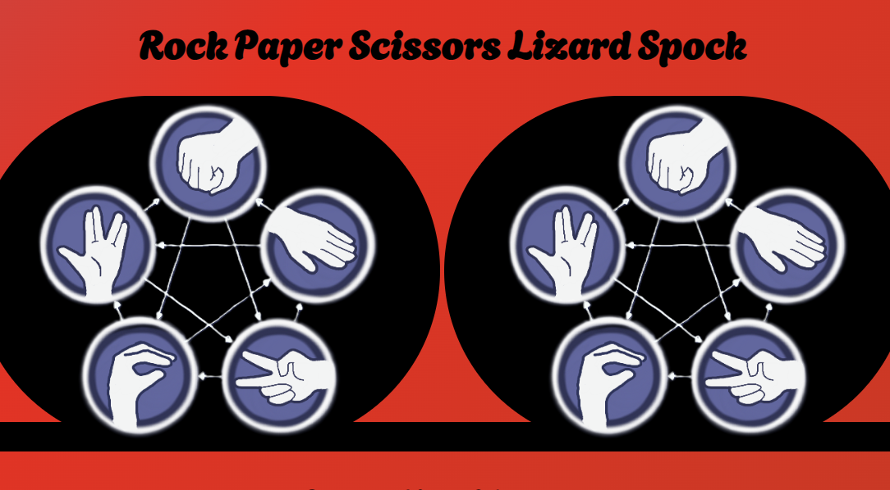
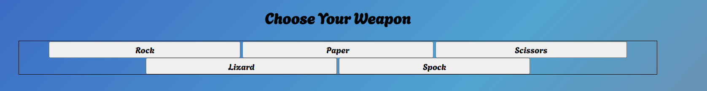
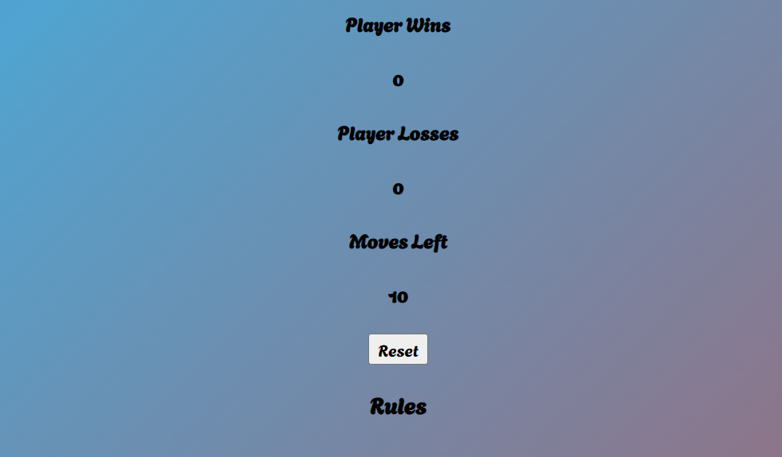
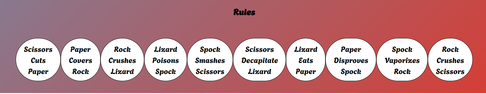
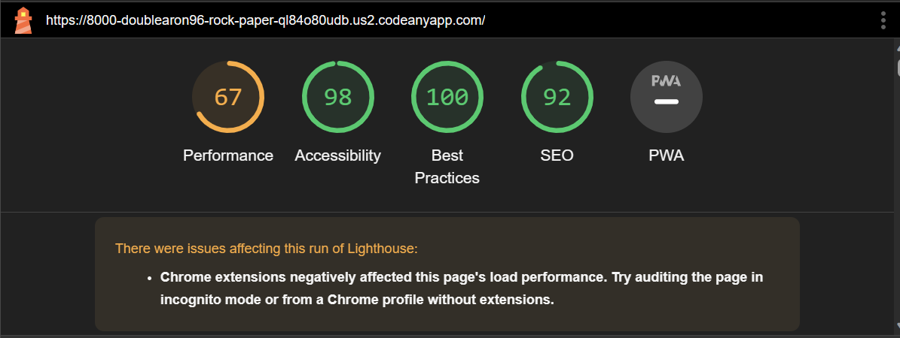

# Rock Paper Scissors Lizard Spock 

[Visit the website here](https://doublearon96.github.io/rock-paper-scissors-lizard-spok/)

## Welcome

This website is a mini game to help pass time while you wait also to shows you how random a computer can be.

This Website has the following content included:

1. images that change with choices
2. rules at the bottom to understand why you won or lost the round
3. a rest button so you can try beat your score

The goals set for this project are:

1. To have a fully working mini game
2. rules that the code understands and goes through to give results
3. button interaction so the customer can interact with the game

---

## UX

While planning and taking in the principles of UX, planning how it will bring in the audience and future customers.

Website Target audience:

* ages between 18 to 40.
* big bang theory fans.
* people that have to wait for a little bit of time.
* also for groups of friends.
  
What the clients will be looking for:

* Easy way to pass time.
* Clear and high-quality Pictures.
* the correct results.
* Easy to understand.
the plan is to hit all of these targets and keep improving and adapting.

the website is responsive to cover all bases because the age range we are aiming for the site covers both mobile to full-screen computers.

### Structure

the website is a basic rock paper scissors lizard spock with two images that change to the image you have chosen. under that you have the player choices these are buttons that go red after selecting your choice,
after that there is player wins, losses and moves left, the numbers will increase for the for the player wins and losses but the moves left will decrees instead.

the reset button will reset everything on the screen so the images will go to the default and all the wins losses and moves left will go back to their default number.

the last element is the rules are responsive and fit with the page they have what wins and says why to, it changes from inline-flex to inline-table. an addition i am planning on making the rule that the game out come will change colour so its easier than.

the background has different background colours dependent on the screen size for a extra change 

### Scope

To help achieve our company goals the full deployment will have:

* simply design so anyone can use it.
* images clear and high quality.
* simple java script functions and easy to update and improve.
* HTML and CSS fully responsive.
* Easy to access global variable.

### Surface

the colours and images are simple so its not over whelming 

I also used Agbalumo font because it was nice and worked well with the site shape all the other fonts I tried just didn't feel right

### Features

The web page is fully responsive and designed for mobile phones and then designed to moved up through the screen sizes to work fully with the background changing colour. the page is set out into sections to make it easier to read with a header, then main images and player choice, also and score counter and reset button then a footer with all the rules.

### Heading Main Images

The main images are nice and clear and they also change with player and computers choice.

### Player Choices

the player choices are the main function they activate everything, they also have a red background when clicked so the player knows there choice.

the js is basically three function joined into one and that is the game function that is called, when the player makes their choice.

### The Score And Reset button 

The score section has a bit of js to get the count down and the score to count correctly and the reset but is basically for this section and the main images so you get a nice fresh page. 

### Rules

The rules are a nice little way to know what move beats what and no other functions yet.

### Technologies Used

- [HTML](https://developer.mozilla.org/en-US/docs/Web/HTML)
   -Used as the basic building block for the project and to structure the content.
* [CSS](https://developer.mozilla.org/en-US/docs/Learn/Getting_started_with_the_web/CSS_basics)
    -Used to style all the web content across the project.
* [Font Awesome](https://fontawesome.com/)
  * Used to obtain the social media icons used in the footer and the icons in La Petite Review.
* [Html, CSS](https://www.w3schools.com/css/css_positioning.asp)
  * W3 learning helped fix my code and gave me some ideas like the grid display to using links.
* [footer, HTML, CSS](https://learn.codeinstitute.net/ci_program/diplomainfullstacksoftwarecommoncurriculum)
  * Coding institute love running Project helped me do the four I liked the way it looked simple but smooth
* [Google Developer Tool](https://developer.chrome.com/docs/devtools/)
  * Google Developer tool I used this to help fix issues without having to mess around with the main code.
* [Git](https://git-scm.com/)
  * Used for version control by utilizing the Gitpod terminal to commit to Git and Push to GitHub.
* [Gitpod](https://www.gitpod.io/)
  * Used as the development environment.
  * [Favicon. io](https://favicon.io/)
    * Used to create favicons for my website
* [W3C Markup Validation Service](https://validator.w3.org/)
  * Used to validate all HTML code written and used in this webpage.
* [W3C CSS Validation Service](https://jigsaw.w3.org/css-validator/#validate_by_input)
  * Used to validate all CSS code written and used in this webpage.
* [JSHint Validation service](https://jshint.com/)
  * Used to validate all Java Script code written and used in this webpage. 
* [Spelling Checker]( https://open-vsx.org/extension/streetsidesoftware/code-spell-checker)
  *  i used this to help write this and all my code too.

### Testing

These are the tests I have done

1. The first thing i tested was all the buttons.
2. The second thing was i used console.logs to help check the java script and help debug if needed.
3. Then after that i would play every hand and make sure the rules i set are giving the right result.
4. the last was checking the console logs to make sure the code runs all the way through

##### Code Valadation

   with this I used W3 mark-up checker by copying each page and the CSS in and if there were any problems I fixed them and and ran it again.

   I also used JS Hint as well to make sure my java script was all correct and works fine.

##### Grammarly

   I thought that the best thing to check was my spelling and Grammarly helped load all I did was copy, paste, and check it breaks down all the errors and lets you fix them all.

##### Lighthouse check

   
   this was the easiest one just open the Google Development tool and then click on more tools then lighthouse and the final part press the check button

### Deployment

1. Log in to GitHub
2. In your Repository section, select the project repository that you want to deploy
3. In the menu located at the top of this section, click 'Settings'
4. Select 'Pages' on the left-hand menu - this is around halfway down
5. In the source section, select branch 'main' and save
6. The page is then given a site URL which you will see above the source section, it will look like the following:

Please note it can take a while for this link to become fully active.

*Forking the GitHub Repository*

If you want to make changes to your repository without affecting it, you can make a copy of it by 'Forking' it. This ensures your original repository remains unchanged.

1. Find the correct GitHub repository
2. In the top right corner of the page, click the Fork button
3. Your repository has now been 'Forked' and you have a copy to do what you want to.

*Cloning the GitHub Repository*

Cloning your repository will allow you to download a local version of the repository to be worked on. Cloning is a good way to back up your work and have a spare copy

1. Find the relevant GitHub repository
2. Press the arrow on the Code button
3. Copy the link that is shown in the drop-down
4. Now open Gitpod & and select the directory location where you would like the clone created
5. In the terminal type 'git clone' & and then paste the link you copied into GitHub
6. Press enter and your local clone will be created.

---

## Credits

these are the websites I used to help me beat some of the bugs I encountered.
[flex box froggy](https://flexboxfroggy.com/)
I used this to help understand how the flexbox works.
[W3 learing](https://www.w3schools.com/css/css_positioning.asp)
this was the main one for any issues.
[code instituet](https://learn.codeinstitute.net/ci_program/diplomainfullstacksoftwarecommoncurriculum)
this was also the big one that helped me used bits from the Love Running project to help me understand
my form and all the socials were the big ones.
[W3 Validator](https://validator.w3.org/)
 for checking my work.
 [Favicon](https://favicon.io/favicon-generator/)
 for my favicon icon.
 [Am I Responsive](https://ui.dev/amiresponsive?url=https://doublearon96.github.io/Samcohoses/index.html)

 [Dasiy Gunn](https://github.com/daisygunn/la-petite-traveller/blob/master/README.md)
 I used Dasiy's Read me to help make my own one.
 [java Scrip Hints](https://www.geeksforgeeks.org/rock-paper-and-scissor-game-using-javascript/),(https://stackoverflow.com/questions/17976883/rock-paper-scissors-in-javascript)
 i used these websites to help get my code working and if i missed anything out.
 [CSS Background](https://www.sliderrevolution.com/resources/css-animated-background/)
 this helped me design the background and get it working nicely.
#### Direct people

Ciaran merritt my friend from school, Harry Dhillon my tutour support

### Bugs

one of the bugs i have is this violation it hasn't shown any effects on the game and it only shows in the console but if you wait a second of two before doing another it works fine.

## Thank You For Reading 
